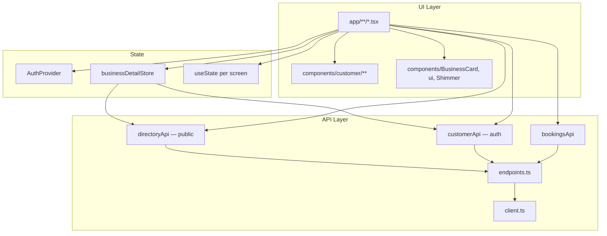

# Codebase Guide — Hindustan Customer App

**Read this file first.** Single onboarding doc: product context, architecture, code map, and where to change what.

Sibling vendor app: `../Hindustan/docs/CODEBASE.md`.

Other docs: [`API_INTEGRATION_GUIDE.md`](API_INTEGRATION_GUIDE.md), [`../CHANGES_SUMMARY.md`](../CHANGES_SUMMARY.md), [`../README.md`](../README.md).

---

## 60-second orientation

| Question | Answer |
|----------|--------|
| **What is this?** | Expo 57 **customer** app — browse businesses, favourites, enquire, book, review (`role: "customer"`). |
| **Entry** | `app/index.tsx` → `(tabs)` or `(auth)/welcome`. |
| **Public browse** | `directoryApi.*` — **no auth** required for search/home/business detail load. |
| **Authenticated** | Favourites sync, enquiries, bookings, reviews, profile — `customerApi.*`. |
| **Auth** | Refresh token key `hd_customer_refresh_token`; rejects `role !== "customer"`. |
| **Business detail** | `app/business/[slug].tsx` + **`businessDetailStore`** (Zustand) + tabbed About/Products/Reviews. |
| **Lists** | FlashList on home/search; memoized `BusinessCard`. |
| **Before API work** | Read `docs/API_INTEGRATION_GUIDE.md`. |

---

## Product features

### Tab shell (`app/(tabs)/`)

| Tab | Route | Purpose |
|-----|-------|---------|
| Home | `(tabs)/index` | Featured / browse businesses (FlashList) |
| Search | `(tabs)/search` | Search + filters (FlashList) |
| Saved | `(tabs)/favourites` | Favourites (auth required) |
| Profile | `(tabs)/profile` | Account, links to bookings/enquiries/reviews |

### Core flows

| Feature | Route | Auth | API |
|---------|-------|------|-----|
| Business profile | `business/[slug]` | No* | `directoryApi.business(slug)` |
| Enquire | Modal on business page | Yes to submit | `customerApi.createEnquiry` |
| Book appointment | `bookings/new` | Yes | `bookingsApi` + slots |
| My bookings | `bookings/index` | Yes | `customerApi.listBookings` |
| My enquiries | `enquiries/index` | Yes | `customerApi.listEnquiries` |
| My reviews | `reviews/index` | Yes | `customerApi.listReviews` |
| Write/edit review | Modal on business page | Yes | `customerApi` review endpoints |
| Report business | Modal on business page | Yes | report API via `customerApi` |

\*Page loads without auth; Save/Enquire/Review prompt login.

### Account & auth

| Feature | Route | API |
|---------|-------|-----|
| Welcome / login / register | `(auth)/*` | `authApi.*` with `role: "customer"` |
| Edit profile | `profile/edit` | `usersApi` |
| Change password | `profile/change-password` | `authApi.changePassword` |
| Sessions | `profile/sessions` | `authApi.listSessions` |

### Placeholder / future

| Route | Status |
|-------|--------|
| `support.tsx` | Static / local UX — no backend §18 yet |
| `notifications.tsx` | Placeholder — no read/push API in guide yet |

---

## Tech stack

Same core as vendor: **Expo 57**, **RN 0.86**, **NativeWind 4**, **expo-router**, **FlashList**, **Zustand** (`businessDetailStore`), **SecureStore**, **Reanimated** (shimmer).

Release Android: ProGuard + resource shrink via `app.config.ts`; local signing scripts in `scripts/`.

---

## Architecture



### Public vs authenticated

```
Home / Search / business/[slug] vendor fetch → directoryApi (Bearer optional)
Favourites / bookings / enquiries / reviews → customerApi (Bearer required)
Login always sends role: "customer"; AuthProvider rejects vendor tokens
```

---

## Code map (directory tree)

```
Hindustan-Customer/
├── app/
│   ├── _layout.tsx                 # Stack + AuthProvider
│   ├── index.tsx                   # Auth redirect
│   ├── (auth)/                     # welcome, login, register, password reset
│   ├── (tabs)/                     # home, search, favourites, profile
│   ├── business/[slug].tsx         # ★ Main business detail + modals + tabs
│   ├── bookings/                   # index (list), new (create)
│   ├── enquiries/index.tsx
│   ├── reviews/index.tsx
│   ├── profile/                    # edit, change-password, sessions
│   ├── support.tsx                 # placeholder
│   └── notifications.tsx           # placeholder
│
├── components/
│   ├── ui.tsx                      # Button (+ iconNode), Card, ScreenState
│   ├── Field.tsx / KeyboardForm.tsx
│   ├── BusinessCard.tsx            # Memoized search/home card
│   ├── Shimmer.tsx                 # ShimmerHome, ShimmerBusinessList, ShimmerBusinessDetail
│   ├── SignInGate.tsx
│   └── customer/
│       ├── AccentCard.tsx          # Card shell (enquiries, bookings rows)
│       ├── accent.ts
│       ├── BrandIcons.tsx          # Social + WhatsApp icons/helpers
│       ├── FilterList.tsx          # FilterSelectField, FormSelectSheet, SelectSheet
│       ├── AssignmentCard.tsx      # Assignee row + change icon (vendor parity)
│       ├── ListPagination.tsx
│       ├── SheetModal.tsx / ReviewEditModal.tsx
│       ├── SavedBusinessCard.tsx
│       └── business/
│           ├── BusinessHeader.tsx  # Hero, Call/WhatsApp, hours, social
│           ├── BusinessTabBar.tsx  # About | Products | Reviews
│           ├── BusinessProductRow.tsx
│           └── BusinessReviewRow.tsx
│
├── src/
│   ├── api/                        # Same pattern as vendor (client, endpoints, types, baseUrl)
│   ├── auth/AuthProvider.tsx       # role === "customer" guard
│   ├── stores/businessDetailStore.ts  # ★ Business page state machine
│   ├── lib/                        # datetime, money, phone, safeLinking, env
│   ├── media/pickImage.ts
│   └── navigation/chrome.ts
│
├── docs/
│   ├── CODEBASE.md                 # ← You are here
│   └── API_INTEGRATION_GUIDE.md
├── scripts/                        # android-release-build.sh, inject-android-signing.mjs
├── build-apk.sh / build-production.sh
└── app.config.ts
```

---

## Route → file map

| Path | File | Auth | Notes |
|------|------|------|-------|
| `/` | `app/index.tsx` | — | Redirect |
| `/(tabs)/` | `app/(tabs)/index.tsx` | No | Featured list |
| `/(tabs)/search` | `app/(tabs)/search.tsx` | No | Search FlashList |
| `/(tabs)/favourites` | `app/(tabs)/favourites.tsx` | Yes | Saved businesses |
| `/(tabs)/profile` | `app/(tabs)/profile.tsx` | Mixed | Hub + sign in |
| `/business/[slug]` | `app/business/[slug].tsx` | Mixed | Store-driven tabs |
| `/bookings` | `app/bookings/index.tsx` | Yes | Upcoming/past tabs |
| `/bookings/new` | `app/bookings/new.tsx` | Yes | Slot picker |
| `/enquiries` | `app/enquiries/index.tsx` | Yes | AccentCard list |
| `/reviews` | `app/reviews/index.tsx` | Yes | Customer reviews |
| `/profile/*` | `app/profile/*.tsx` | Yes | Account |
| `/support` | `app/support.tsx` | — | Static |
| `/notifications` | `app/notifications.tsx` | — | Placeholder |

---

## API modules (`src/api/endpoints.ts`)

| Export | Scope | Key methods |
|--------|-------|-------------|
| `authApi` | Auth | login (`role: "customer"`), register, sessions, password |
| `usersApi` | Profile | `me`, patch profile |
| `directoryApi` | **Public** | `search`, `featured`, `business(slug)`, categories |
| `customerApi` | **Customer auth** | favourites, enquiries, reviews, report |
| `bookingsApi` | **Customer auth** | list/create/cancel bookings, available slots |

**Do not call** vendor routes (`/vendors/me`, `/leads`, `/inventory`, vendor booking **request** management).

---

## `businessDetailStore` (critical path)

File: `src/stores/businessDetailStore.ts`  
Consumed by: `app/business/[slug].tsx`

| State | Purpose |
|-------|---------|
| `vendor` | Loaded via `directoryApi.business(slug)` |
| `tab` | `about` \| `products` \| `reviews` |
| `products` / `reviews` | Lazy-loaded when tab selected |
| `isSaved` / `favBusy` | Favourite toggle |
| `myReview` | Current user's review for this vendor |

| Action | Behavior |
|--------|----------|
| `load(slug, isAuthenticated)` | Fetch business + optional fav/review state |
| `setTab(tab)` | Switch tab; triggers lazy load |
| `toggleFavourite(...)` | Returns `"auth"` if login needed |
| `reset()` | On unmount / slug change |

UI split:

- **About tab** → `ScrollView` + `BusinessHeader`
- **Products tab** → `FlashList` + `BusinessProductRow`
- **Reviews tab** → `FlashList` + `BusinessReviewRow` + pagination

---

## Auth & session

Same pattern as vendor (`src/api/client.ts`):

- Access token in memory only
- Refresh in `hd_customer_refresh_token`
- Serialized refresh on 401
- `AuthProvider` throws if `user.role !== "customer"` after login/register/refresh

---

## UI patterns

### `ScreenState` + shimmer

| Screen type | Shimmer component |
|-------------|-------------------|
| Home | `ShimmerHome` |
| Search / favourites | `ShimmerBusinessList` |
| Business detail | `ShimmerBusinessDetail` (tab bar + hero + Call/WhatsApp rows) |
| Enquiries / bookings / reviews / sessions | `ShimmerList variant="accent"` |

### `BusinessCard` (`components/BusinessCard.tsx`)

Used on home + search FlashLists — always wrap in `memo`, pass `onPress(slug)`.

### Business contact (`BusinessHeader.tsx`)

- **Call** / **WhatsApp** labeled `Button`s (WhatsApp uses `WhatsAppIcon` via `iconNode`)
- Maps / website: circular `LinkIconButton`s
- Enquire / Book / Save: primary actions row

### Modals on business page

Defined inline in `business/[slug].tsx` or via shared components:

- Enquiry form → **`SheetModal`**
- Review → **`ReviewEditModal`** (wraps `SheetModal`)
- Report → reason picker + `customerApi`

**Sheet modal pattern:** root `flex-1` + full-screen dim pressable; white sheet at bottom with safe-area padding (`SheetModal.tsx`).

### Select fields

- **`FormSelectSheet`** in `FilterList.tsx` — same 4+ options tap-to-select pattern as vendor app (for future filters/forms).

### Sign-in gates

Screens with **custom icon** empty states (enquiries, bookings, etc.) use inline auth UI — not always `SignInGate`.

---

## Shared libraries (`src/lib/`)

| Module | Purpose |
|--------|---------|
| `datetime.ts` | `formatBookingDate`, `formatSlotTime`, `formatCreatedDate`, `formatSessionWhen`, `timeGreeting`, `DAY_LABELS`, `isUpcomingBooking` |
| `money.ts` | `formatPriceRange(min, max)` |
| `phone.ts` / `phoneFormat.ts` | `openTel`, `openWhatsApp` |
| `safeLinking.ts` | `openSafeExternalUrl` — HTTPS in release |
| `env.ts` | `isDevBuild()` |

---

## Agent checklist

### Do

- Use `directoryApi` for browse/search/detail public data.
- Use `customerApi` / `bookingsApi` only when user is authenticated.
- Extend `businessDetailStore` for business-page state — avoid parallel fetch logic in the screen.
- Match API types to `API_INTEGRATION_GUIDE.md`.
- Run `tsc --noEmit` + `npm run selfcheck`.

### Don't

- Call vendor-panel endpoints from this app.
- Implement full notifications/support until backend §18 exists.
- Use `http://` API URL in release builds.
- Duplicate `BusinessHeader` logic on other screens — import the component.

---

## Commands

```bash
npm install && npm start
npm run selfcheck
./node_modules/.bin/tsc --noEmit
./build-apk.sh                    # Local signed APK
npm run build:apk
```

---

## Where to start for common tasks

| Task | Start here |
|------|------------|
| Business page change | `app/business/[slug].tsx` + `businessDetailStore` + `components/customer/business/*` |
| Home / search list | `(tabs)/index.tsx` or `search.tsx` + `BusinessCard` + `timeGreeting` on home |
| Multi-option form/filter | `FormSelectSheet` in `components/customer/FilterList.tsx` |
| Modal / sheet UX | `SheetModal.tsx` — full-screen dim + bottom white panel |
| New customer screen | `app/_layout.tsx` + new route file |
| New authenticated API | Guide → `endpoints.ts` → `types.ts` |
| Favourite toggle | `businessDetailStore.toggleFavourite` |
| Booking flow | `bookings/new.tsx` + `bookingsApi` slots |
| Loading UX | `components/Shimmer.tsx` |

---

## Feature ↔ code quick reference

```
Browse     → directoryApi + BusinessCard + FlashList
Detail     → business/[slug] + businessDetailStore + BusinessHeader + tabs
Enquire    → SheetModal in [slug] + customerApi.createEnquiry
Book       → bookings/new + bookingsApi
Favourite  → businessDetailStore + customerApi favourites
Review     → ReviewEditModal + customerApi review endpoints
Account    → (auth)/* + profile/* + AuthProvider
```

---

*Last aligned with: tabbed business detail, FlashList lists, security refactor, SheetModal backdrop, FormSelectSheet parity, time greeting.*
